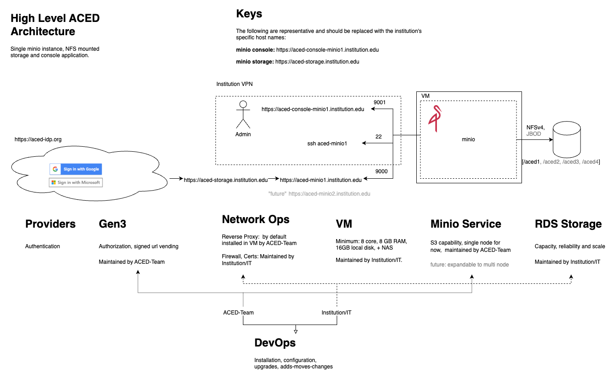
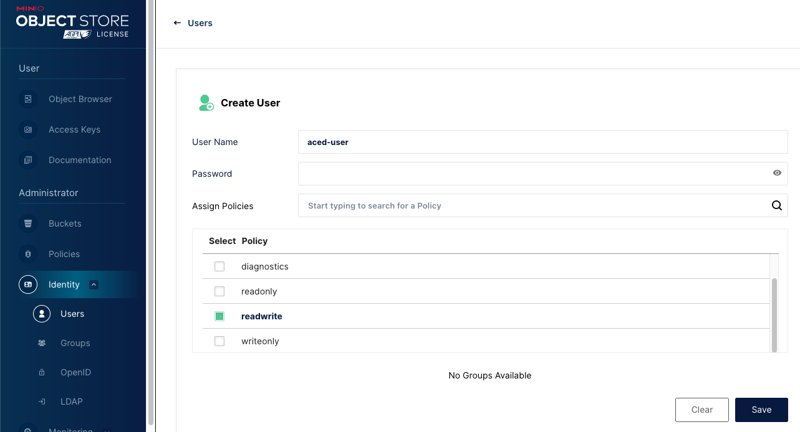

# minio-deploy

An Ansible playbook to install, configure, and deploy a Minio instance.

Uses [ansible-minio](https://github.com/atosatto/ansible-minio) as the Ansible Role that will do a lot of the heavy lifting for us!

## High Level Architecture


## Usage

Copy and edit the inventory file to fit your server and credentials: 

```sh
cp inventory-example inventory
vi inventory
```

Then run the following to install the required role and run the playbook -- 

```sh
ansible-galaxy install atosatto.minio
ansible-playbook minio-deploy.yaml
ansible-playbook minio-deploy.yaml -i inventory --ask-pass --ask-become
```

A given run is expected to take ~10 minutes to complete.

To change the values provided to MinIO simply edit the inventory file and rerun the playbook command.

## Running the Playbook

```sh
python3 -m venv venv
source ./venv/bin/activate
pip install ansible
```

## Requirements

- Virtual Machine (VM): the VM is the server that will is expected to run the MinIO server
    - Recommended distros include:
        - [RHEL](https://www.redhat.com/en/technologies/linux-platforms/enterprise-linux) or derivate such as [Rocky Linux](https://rockylinux.org/)
        - [Ubuntu](https://ubuntu.com/download/server) or similar Debian-based distribution
    - Port 443 must be open and accessible from the external internet to access the MinIO endpoint
    - It is recommended to run a firewall service (e.g. [firewalld](https://firewalld.org/)) for security purposes
- Domain name: a dedicated URL that will be used as the endpoint for the MinIO server
- SSL Certificate: certificate and key files that will be used to serve MinIO on port 443 via Nginx 
    - [Cerbot](https://certbot.eff.org/) by the [EFF](https://www.eff.org/) is a service that can generate SSL certificate following domain validation. 

### IT Tasks

- Allocate VM with space for data storage (e.g. One of our MinIO servers has a data mount storage of 5 TB's)
- Create the SSL certificate (and key file) for use with Nginx. Services such as [Certbot](https://certbot.eff.org/) can be helpful in this case
- Keep the SSL certificate up to date (automatic renewal is recommended)
- Keep VM up to date via official security channels or patches (e.g. following [RHEL](https://access.redhat.com/security/security-updates/) or [Ubuntu](https://ubuntu.com/security/notices) security updates)

## Next Steps

### 1. Nginx installation

Nginx can now be installed to provide a web server for MinIO.

```sh
# Ubuntu running systemd example
apt-get update
apt-get install nginx
systemctl start nginx
systemctl enable nginx

cp minio.conf /etc/nginx/conf.d/minio.conf
systemctl reload nginx
```

### 2. Credentials & User Management

[MinIO Reference](https://min.io/docs/minio/linux/administration/identity-access-management/minio-user-management.html#create-a-user)

Set MinIO admin credentials in `/etc/default/minio`:

```
MINIO_ROOT_USER=<admin_username>
MINIO_ROOT_PASSWORD=<admin_password>
```

Create initial user with `readwrite` permissions via the `mc` command or through the web console:



### 3. Data Upload & Download

It should now be possible to access the MinIO endpoint using the newly created user for data upload and download tasks.

## Manual Minio Installation

This playbook aims to replicate the steps used in the initial ACED-IDP Minio deployment at OHSU (based on CentOS).

```sh
sudo yum -y install wget
wget https://dl.min.io/server/minio/release/linux-amd64/archive/minio-20230210184839.0.0.x86_64.rpm -O minio.rpm

sudo yum -y install minio.rpm
test -f  /etc/systemd/system/minio.service && echo "minio.service config exists, installed bu minio.rpm"

sudo groupadd -r minio-user
sudo useradd -M -r -g minio-user minio-user

# where /dev/vdb is the openstack volume, formatted with fdisk and mkfs.xfs /dev/vdb
sudo chown minio-user:minio-user /dev/vdb
sudo fdisk -l

test -f  /etc/default/minio || echo "creating /etc/default/minio"
```

## References

- https://github.com/ricsanfre/ansible-role-minio
    - An alternative Ansible Role with a self signed TLS step included

- https://docs.ansible.com/ansible/latest/playbook_guide/playbooks_intro.html
    -  The official Ansible Playbook documentation.
